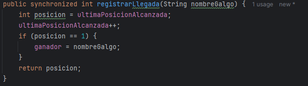

##### Parte II - Simulación de Carreras de Galgos

En este ejercicio se desarrolla un simulador de carreras de galgos, donde cada galgo es representado por un hilo de ejecución. A nivel de programación, todos los galgos poseen la misma velocidad; por lo tanto, el resultado de la carrera depende del scheduling del procesador. Es decir, el galgo ganador será aquel que, por azar, reciba más ciclos de CPU durante la ejecución.

**Problema Original Detectado**

Al iniciar la aplicación, se detecta un error evidente: los resultados de la carrera (distancia recorrida y número del galgo ganador) se muestran antes de que todos los hilos hayan finalizado su ejecución. Esto genera inconsistencias, como la visualización de datos incompletos o nulos en la interfaz gráfica. Además, se identificó la posibilidad de condiciones de carrera que podrían afectar la precisión del resultado final.

Para garantizar la correcta sincronización entre los hilos y evitar que se muestren resultados prematuros, se implementó el uso de join() en cada hilo. Esta técnica permite que el hilo principal espere a que todos los galgos terminen su recorrido antes de calcular y mostrar el ganador.

Con la implementación de join(), la simulación ahora muestra correctamente al galgo ganador una vez que la carrera ha finalizado por completo, eliminando los errores de sincronización y mejorando la fiabilidad del sistema.

Una vez resuelto el problema inicial, se procedió a probar el programa con el objetivo de identificar posibles regiones críticas. Durante estas pruebas, se observó que dos galgos podían ocupar la misma posición, lo que provocaba que el ganador no siempre fuera el primer galgo en llegar a la meta. Esta situación se debía a que las variables compartidas ultimaPosicionAlcanzada y ganador eran accedidas sin mecanismos de sincronización adecuados.

Para solucionar este problema, se modificó la región crítica correspondiente, ya que varios galgos podían ejecutarla simultáneamente, lo que alteraba el resultado final de la carrera. La solución consistió en crear un método sincronizado dentro de la clase RegistroLlegada, con el fin de garantizar que solo un galgo a la vez pudiera ejecutar dicho bloque de código. De este modo, se evita que dos galgos ocupen la misma posición y se asegura una correcta determinación del ganador.

4.  Implemente las funcionalidades de pausa y continuar. Con estas,
    cuando se haga clic en ‘Stop’, todos los hilos de los galgos
    deberían dormirse, y cuando se haga clic en ‘Continue’ los mismos
    deberían despertarse y continuar con la carrera. Diseñe una solución que permita hacer esto utilizando los mecanismos de sincronización con las primitivas de los Locks provistos por el lenguaje (wait y notifyAll).