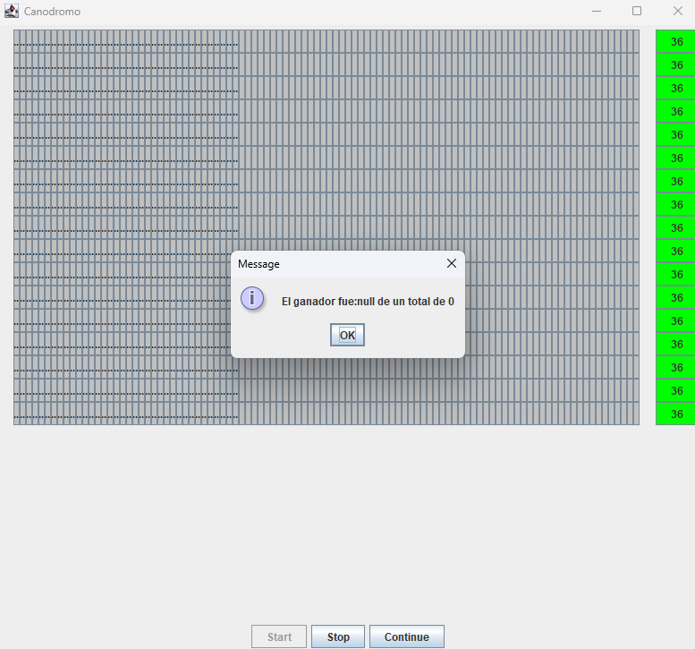
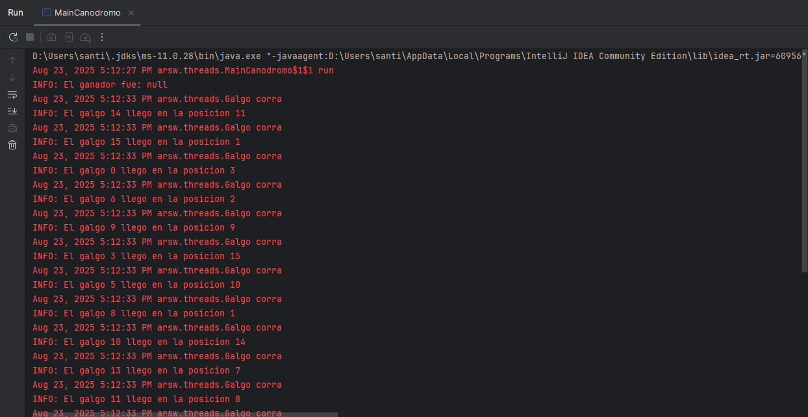
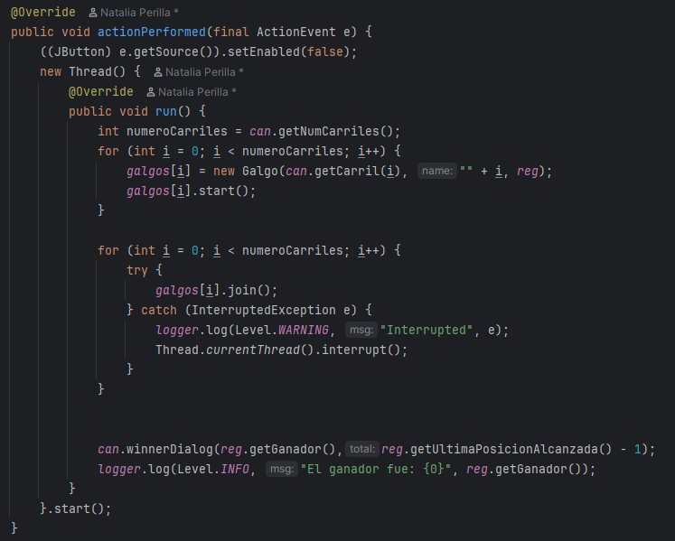
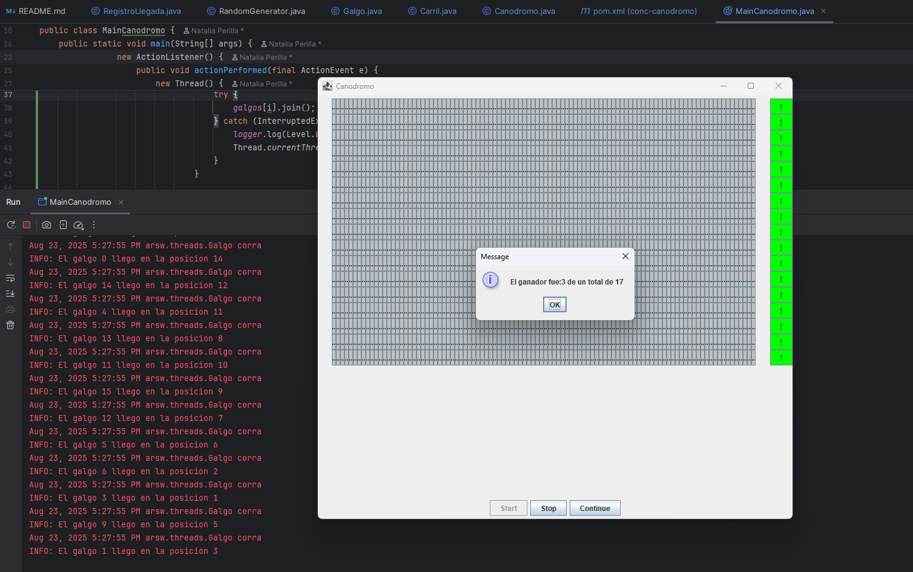

##### Parte II - Simulación de Carreras de Galgos

En este ejercicio se desarrolla un simulador de carreras de galgos, donde cada galgo es representado por un hilo de ejecución. A nivel de programación, todos los galgos poseen la misma velocidad; por lo tanto, el resultado de la carrera depende del scheduling del procesador. Es decir, el galgo ganador será aquel que, por azar, reciba más ciclos de CPU durante la ejecución.

**Problema Original Detectado**

Al iniciar la aplicación, se detecta un error evidente: los resultados de la carrera (distancia recorrida y número del galgo ganador) se muestran antes de que todos los hilos hayan finalizado su ejecución. Esto genera inconsistencias, como la visualización de datos incompletos o nulos en la interfaz gráfica. Además, se identificó la posibilidad de condiciones de carrera que podrían afectar la precisión del resultado final.

Para garantizar la correcta sincronización entre los hilos y evitar que se muestren resultados prematuros, se implementó el uso de join() en cada hilo. Esta técnica permite que el hilo principal espere a que todos los galgos terminen su recorrido antes de calcular y mostrar el ganador.

Con la implementación de join(), la simulación ahora muestra correctamente al galgo ganador una vez que la carrera ha finalizado por completo, eliminando los errores de sincronización y mejorando la fiabilidad del sistema.

2.  Una vez corregido el problema inicial, corra la aplicación varias
    veces, e identifique las inconsistencias en los resultados de las
    mismas viendo el ‘ranking’ mostrado en consola (algunas veces
    podrían salir resultados válidos, pero en otros se pueden presentar
    dichas inconsistencias). A partir de esto, identifique las regiones
    críticas () del programa.

3.  Utilice un mecanismo de sincronización para garantizar que a dichas
    regiones críticas sólo acceda un hilo a la vez. Verifique los
    resultados.

4.  Implemente las funcionalidades de pausa y continuar. Con estas,
    cuando se haga clic en ‘Stop’, todos los hilos de los galgos
    deberían dormirse, y cuando se haga clic en ‘Continue’ los mismos
    deberían despertarse y continuar con la carrera. Diseñe una solución que permita hacer esto utilizando los mecanismos de sincronización con las primitivas de los Locks provistos por el lenguaje (wait y notifyAll).

## Criterios de evaluación

1. Funcionalidad.

    1.1. La ejecución de los galgos puede ser detenida y resumida consistentemente.
    
    1.2. No hay inconsistencias en el orden de llegada registrado.
    
2. Diseño.   

    2.1. Se hace una sincronización de sólo la región crítica (sincronizar, por ejemplo, todo un método, bloquearía más de lo necesario).
    
    2.2. Los galgos, cuando están suspendidos, son reactivados son sólo un llamado (usando un monitor común).

