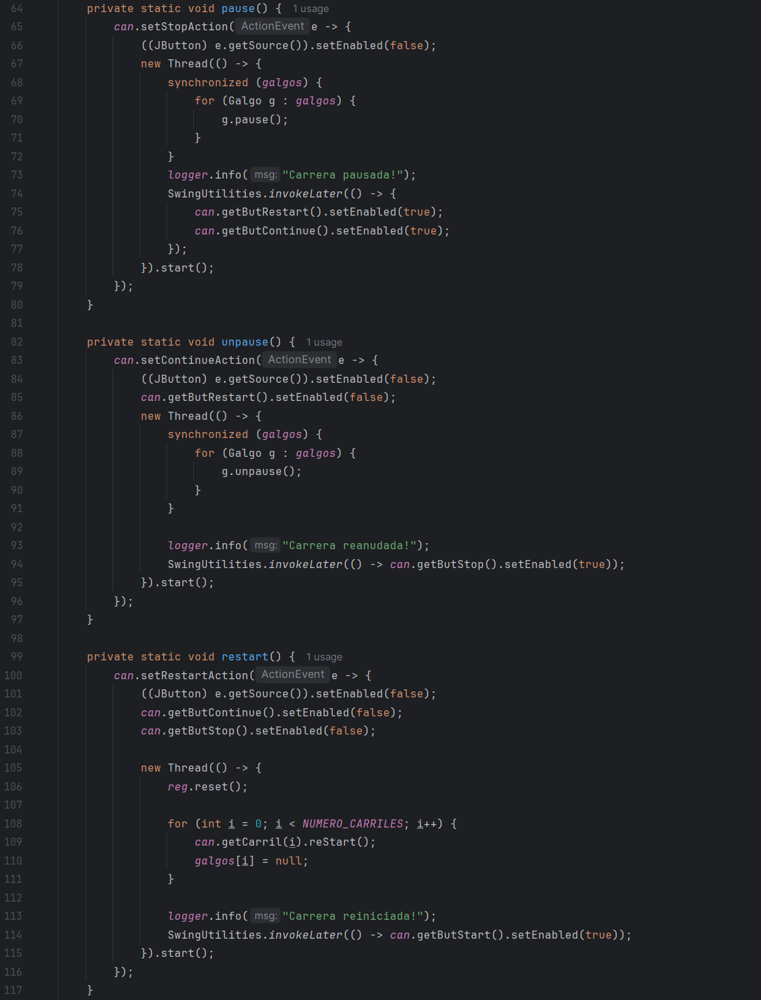
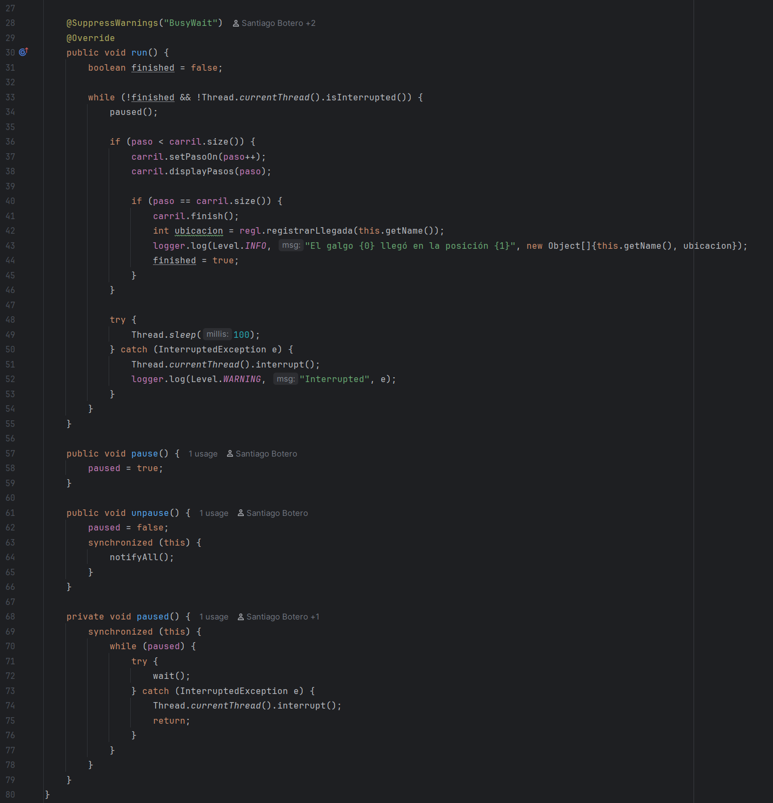
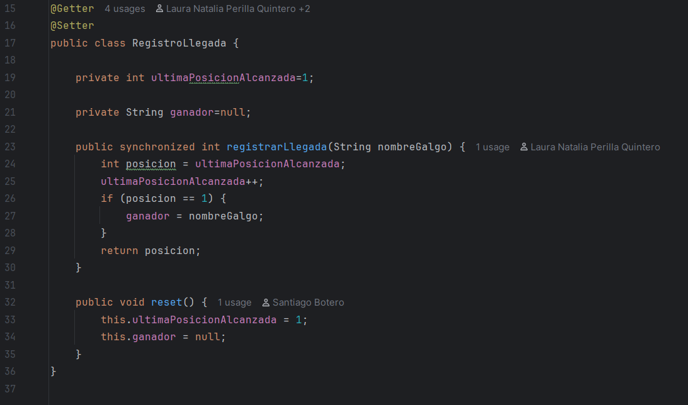
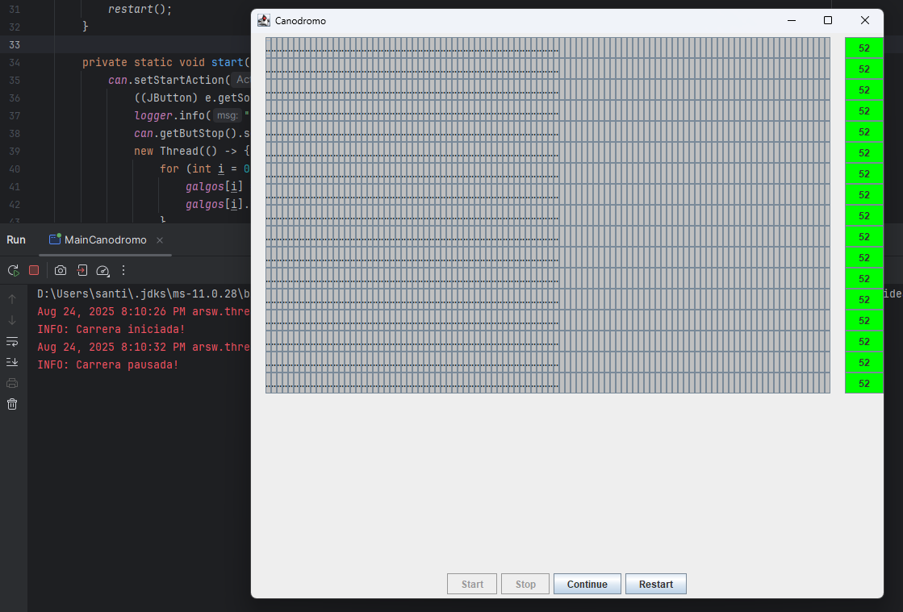
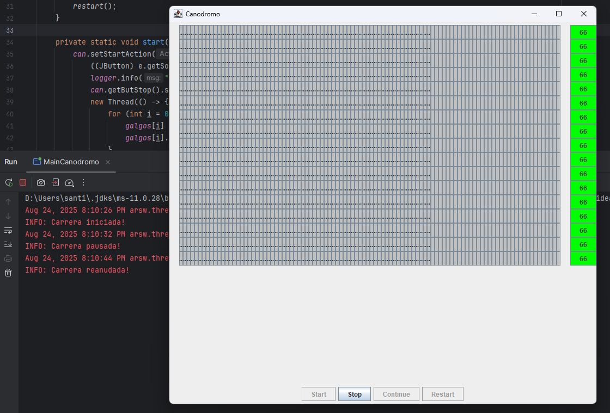
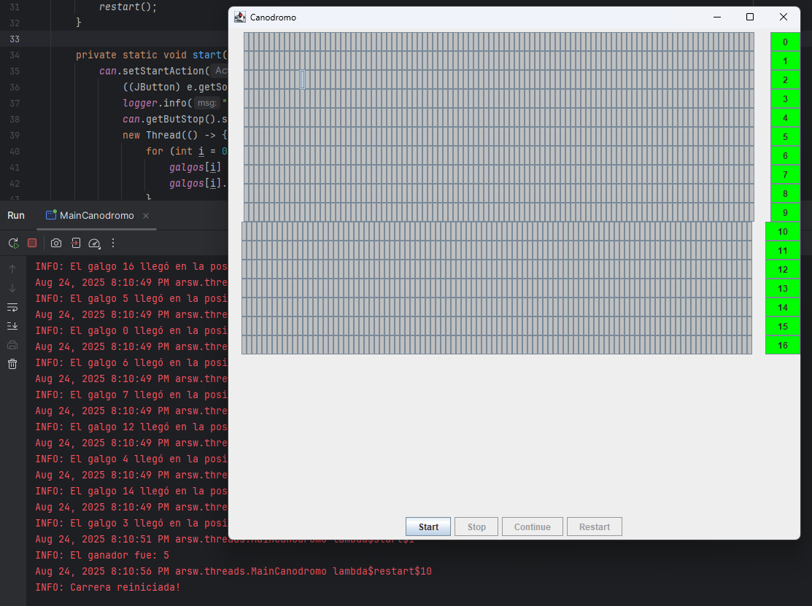

##### Parte II - Simulación de Carreras de Galgos

En este ejercicio se desarrolla un simulador de carreras de galgos, donde cada galgo es representado por un hilo de ejecución. A nivel de programación, todos los galgos poseen la misma velocidad; por lo tanto, el resultado de la carrera depende del scheduling del procesador. Es decir, el galgo ganador será aquel que, por azar, reciba más ciclos de CPU durante la ejecución.

**Problema Original Detectado**

Al iniciar la aplicación, se detecta un error evidente: los resultados de la carrera (distancia recorrida y número del galgo ganador) se muestran antes de que todos los hilos hayan finalizado su ejecución. Esto genera inconsistencias, como la visualización de datos incompletos o nulos en la interfaz gráfica. Además, se identificó la posibilidad de condiciones de carrera que podrían afectar la precisión del resultado final.

Para garantizar la correcta sincronización entre los hilos y evitar que se muestren resultados prematuros, se implementó el uso de join() en cada hilo. Esta técnica permite que el hilo principal espere a que todos los galgos terminen su recorrido antes de calcular y mostrar el ganador.

Con la implementación de join(), la simulación ahora muestra correctamente al galgo ganador una vez que la carrera ha finalizado por completo, eliminando los errores de sincronización y mejorando la fiabilidad del sistema.

Una vez resuelto el problema inicial, se procedió a probar el programa con el objetivo de identificar posibles regiones críticas. Durante estas pruebas, se observó que dos galgos podían ocupar la misma posición, lo que provocaba que el ganador no siempre fuera el primer galgo en llegar a la meta. Esta situación se debía a que las variables compartidas ultimaPosicionAlcanzada y ganador eran accedidas sin mecanismos de sincronización adecuados.

Para solucionar este problema, se modificó la región crítica correspondiente, ya que varios galgos podían ejecutarla simultáneamente, lo que alteraba el resultado final de la carrera. La solución consistió en crear un método sincronizado dentro de la clase RegistroLlegada, con el fin de garantizar que solo un galgo a la vez pudiera ejecutar dicho bloque de código. De este modo, se evita que dos galgos ocupen la misma posición y se asegura una correcta determinación del ganador.

Otro de los problemas detectados en la plataforma estaba relacionado con la implementación de los botones de control (pausa y continuar), ya que inicialmente se encontraban únicamente simulados (mockeados), sin funcionalidad real.

Para implementar correctamente esta funcionalidad, fue necesario recorrer cada instancia de Galgo y suspender su ejecución mediante el uso de wait(). Se incorporó una bandera de control para facilitar la gestión del estado de pausa, y se utilizó notifyAll() para reanudar la ejecución de todos los hilos. Es fundamental que estos métodos estén sincronizados, ya que se trata de una región crítica donde múltiples hilos pueden verse afectados. La correcta sincronización garantiza que todos los hilos se detengan y reanuden de forma coherente, evitando comportamientos indeseados durante la carrera.

Por otro lado, para reiniciar la partida, se debe interrumpir la ejecución de los hilos anteriores, establecerlos como nulos, actualizar la interfaz gráfica y reiniciar los puntajes registrados. En los screenshots que se presentan a continuación, puede observarse la implementación funcional de estas características.

Con las implementaciones realizadas, se puede evidenciar un funcionamiento correcto tanto en el rendimiento como en la ejecución del programa.

Cuando los hilos se encuentran en estado de pausa, la interfaz gráfica se detiene adecuadamente y permanece en espera hasta que se indique reanudar la ejecución:

Al reanudar la partida, la interfaz gráfica retoma su funcionamiento sin inconvenientes, y la lógica del backend continúa ejecutándose correctamente:

Finalmente, al reiniciar la partida (interrumpiendo y eliminando los hilos anteriores), se actualizan tanto la interfaz gráfica como los resultados, lo que permite una gestión completa y coherente de una nueva carrera:

